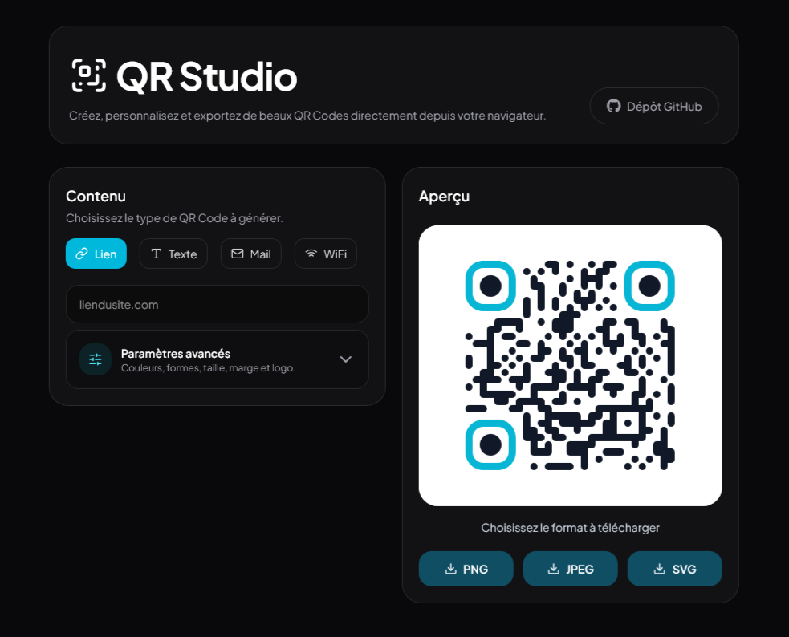

# QR Studio

Open-source QR Code generator built with React, TypeScript and Tailwind CSS.

Create, customize and export beautiful QR Codes directly from your browser.



## Features

### Content Types

- URL
- Text
- Email
- WiFi

### Customization

- QR Code size
- Margin
- Dot color
- Background color
- Corner colors
- Dot styles
- Corner styles
- Logo upload

### Export

- PNG
- JPEG
- SVG

## Smart URL Handling

QR Studio automatically adds `https://` when needed.

Example:

```txt
zeresto.fr
```

becomes:

```txt
https://zeresto.fr
```

## Email QR Codes

Generate QR Codes that automatically open the user's mail application.

Example:

```txt
contact@zayven.fr
```

generates:

```txt
mailto:contact@zayven.fr
```

## WiFi QR Codes

Generate QR Codes allowing users to connect to a WiFi network by scanning the code.

Supported security types:

- WPA / WPA2
- WEP
- Open network

## Tech Stack

- React
- TypeScript
- Vite
- Tailwind CSS
- qr-code-styling
- Lucide React

## Development

Install dependencies:

```bash
npm install
```

Start development server:

```bash
npm run dev
```

Build production version:

```bash
npm run build
```

## Deployment

QR Studio can be deployed easily on:

- GitHub Pages
- Vercel
- Netlify

## Roadmap

- [ ] vCard support
- [ ] Phone number QR Codes
- [ ] SMS QR Codes
- [ ] Social media QR Codes
- [ ] QR templates
- [ ] Dark / Light theme
- [ ] Batch generation

## Contributing

Pull requests are welcome.

If you'd like to propose a feature or report a bug, please open an issue.

## License

MIT License

## Author

Developed by Zayven Labs.

- Website: https://zayven.fr
- GitHub: https://github.com/zayvenlabs